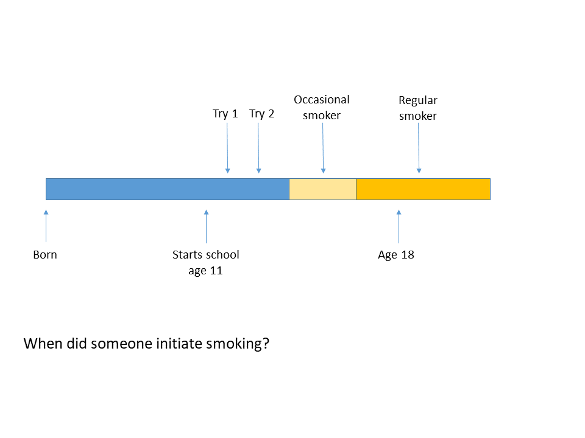
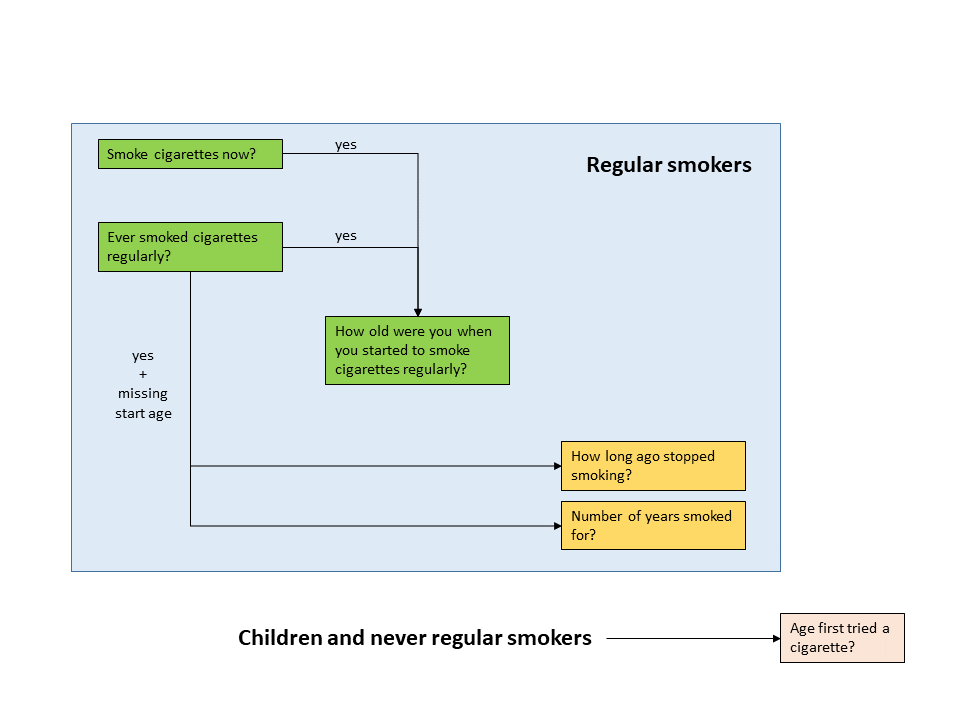
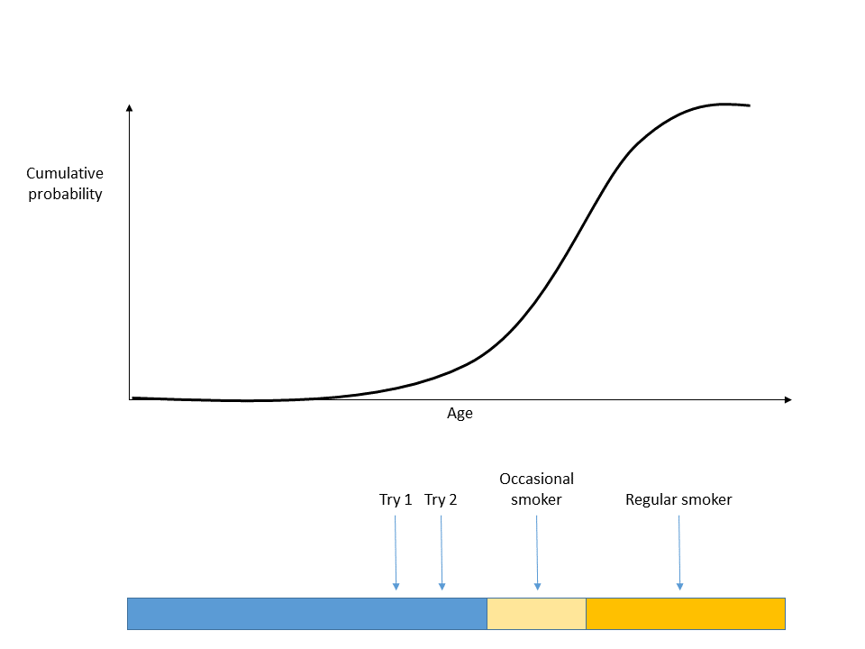
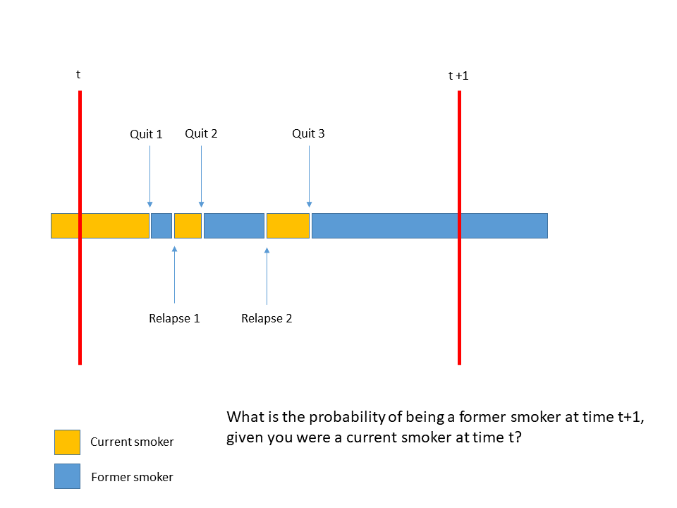

\vskip 1em

School of Health and Related Research (ScHARR), University of Sheffield

\vskip 1em


**Contact**:\
Duncan Gillespie\
Email: [duncan.gillespie\@sheffield.ac.uk](mailto:duncan.gillespie@sheffield.ac.uk){.email}

\vskip 1em

This document is licensed to the University of Sheffield under a [CC by 4.0](https://creativecommons.org/licenses/by/4.0/) license.     


```{r setup, include = FALSE, results = 'hide', warning = FALSE}

knitr::opts_chunk$set(
  collapse = TRUE,
  comment = "#>",
  fig.pos = 'H'
)

options(tinytex.verbose = F)

suppressPackageStartupMessages(library(distill))
suppressPackageStartupMessages(library(magrittr))
suppressPackageStartupMessages(library(knitr))
suppressPackageStartupMessages(library(kableExtra))
suppressPackageStartupMessages(library(data.table))
suppressPackageStartupMessages(library(ggplot2))
suppressPackageStartupMessages(library(readxl))
#suppressPackageStartupMessages(library(tobalcepi))
#suppressPackageStartupMessages(library(stapmr))
#suppressPackageStartupMessages(library(smktrans))
suppressPackageStartupMessages(library(ggthemes))
suppressPackageStartupMessages(library(RColorBrewer))
suppressPackageStartupMessages(library(cowplot))

```

```{r include=FALSE, eval=F}
# automatically create a bib database for R packages
knitr::write_bib(c(
  .packages(), 'bookdown', 'knitr', 'rmarkdown'
), 'packages.bib')
```

\newpage
 
\hypersetup{linkcolor=blue}
\tableofcontents

\newpage

# Abstract {-}

**Introduction:**   
For tobacco control policies and interventions, it is important to reliably estimate probabilities of smoking initiation, quit and relapse and to examine how these change over time and interact to affect patterns of smoking prevalence across the lifecourse for individuals, socio-demographic subgroups and the whole population. This paper develops an integrated method to estimate smoking transition probabilities from repeat cross-sectional smoking survey data in which smoking transition probabilities are estimated for each year and age-group stratified by sex and socio-economic status.   

**Methods:**   
We developed a system of three equations for the initiation, quit and relapse from smoking stratified by age, period, sex and socio-economic status. The methodology includes adjusting for biases on under-reporting of smoking status and differential mortality by smoking status. The estimates are subsequently forecast to allow the micro-simulation of future smoking prevalence based on an extrapolation of the past trends in smoking state transition probabilities over a specific past time period. We operationalised the method with Health Survey for England data for 2003 to 2018. The validity of the method is examined by testing if, when used in a micro-simulation model of smoking prevalence, the method is able to recapitulate the trends in smoking prevalence in the Health Survey for England, and by comparing key descriptive statistics to the Smoking Toolkit Study data for England, which was not used in the estimation of the smoking state transition probabilities.   

**Results:**    
For England between 2003 and 2018, the estimates showed that the probability of smoking initiation declined over time for all groups but that reductions were slowest for males and for people living in the most deprived quintile of socio-economic conditions. The estimated probabilities of quitting smoking showed a distinct age-pattern, with high a high probability of quitting for people under age 25, lower probability of quitting between ages 25 to 45, and a later life rise in the probability of quitting beginning around age 60. Quit probabilities increased gradually over time but were lowest for people living in the most deprived quintile. Relapse probability was higher for younger ages (a probability of x at age y, rising to a probability of z and age z1), for males, for people in the most deprived quintile and also for people within their first few years after quit. [Sentence on vailidity / comparison] Is there also a sentence about forecasting.    

**Conclusions:**    
This integrated method (R package smoketrans v1.0) enables use of repeat cross-section data to estimate smoking transition probabilities. The method can be applied to any country’s repeat cross section survey data provided it has smoking status, age, gender, and SES. The approach enables of modelling of and intervention changes to individual-level dynamic processes of initiation, quit and relapse and integrated into estimation of intervention effects in epidemiological and economic models.      
\vskip 1em

**Keywords:** tobacco control, population dynamics, public health, initiation, quit, relapse, smoking transition probabilities.  

\newpage

# Reproducibility notes

The code that accompanies these notes can be found here https://gitlab.com/stapm/projects/smoking-model-development/smoking_transitions_paper. 


\newpage

# Background
To simulate the effects of tobacco control policies and interventions, it is important to have reliable estimates of the recent history of the smoking state transition probabilities of smoking initiation, quit and relapse by age, sex and socio-economic conditions.    

In 1998, the UK's Smoking White Paper 'Smoking Kills' introduced the first coordinated set of tobacco control policies [@smokingkills]. These actions, followed by successive national tobacco control strategies in the UK have supported individuals to quit and reduced the probability that people will initiate regular smoking [@Beard2019; @opazo2022understanding]. England is now in the final phase of the tobacco epidemic when, although the rate of smoking in adults is nearing 10\% (around 5 million smokers), there is a high frequency of former smokers and the health and mortality effects of smoking are still emerging in cohorts where smoking was once common.   

Smoking is now concentrated among people living in more deprived socio-economic conditions [@Hiscock2012;@nhs2019statistics], which indicates that to understand how England might achieve its smoke-free target, it is important to understand how the population dynamics of smoking have differed among people living in different socio-economic conditions, and how these differences might continue in future.     

The government recently set the ambition for the England to be [smoke-free by 2030](https://www.gov.uk/government/consultations/advancing-our-health-prevention-in-the-2020s/advancing-our-health-prevention-in-the-2020s-consultation-document), meaning that smoking rates in adults should be less than 5\%.   

Computer models are a useful tool to project what might happen to the population-level rates of smoking in the future. The main components of smoking behaviour are the transitions among never, current and former smoking states, and individuals also transition from these smoking states to death. Alternative future scenarios of smoking behaviour can be described in terms of different future trends in the smoking state transition probabilities of initiation, quitting and relapse.   

There are a range of existing computer models that might allow individual-level projections of the prevalence of smoking in the population. Reviews of models have been carried out by Feirman et al [-@feirman2015mathematical; -@feirman2017computational], Berg at al [-@berg2017model], Singh et al [-@singh2020simulating], and Huang et al [-@huang2022identifying]. See the 2019 [scoping review](https://stapm.gitlab.io/images/documents/tobacco_modelling_review%20150819.pdf) conducted to support the development of the Sheffield Tobacco Policy Model.    

The Sheffield Tobacco Policy Model utilises and extends an approach developed to estimate probabilities of smoking initiation and quitting from several years of cross-sectional survey data in the United States [@anderson2012chapter;@holford2014patterns; @tam2018projecting]. See the Supplementary Information to Holford et al. [-@holford2014patterns] (https://ars.els-cdn.com/content/image/1-s2.0-S0749379713006028-mmc1.pdf).    

# The purpose of these notes
The Sheffield Tobacco Policy Model cannot be run without estimates of the annual probabilities of smoking initiation, quitting and relapse. The transition probabilities should be re-calculated when new years of survey data become available or when adapting the model to a new region. Understanding the data and code used to estimate smoking state transition probabilities is an important part of understanding how the Sheffield Tobacco Policy Model works and how to use the methods to conduct new projects.   

# Learning outcomes
Be able to:  

- explain what a smoking state transition probability is and how it is used in the Sheffield Tobacco Policy Model
- describe the different types of data used to estimate the probabilities of smoking initiation, quitting and relapse
- explain the mathematical formulae that describe the approach taken to estimate and bias-correct the probabilities of smoking initiation and quitting
- run the example code to estimate probabilities of smoking initiation, quitting and relapse for England
- plot and quality assure the smoking state transition probability estimates

# Preliminaries
To be able to access the datasets and code you will need access to:  

- The University of Sheffield ScHARR X-drive folder: `X:\ScHARR\PR_STAPM`. To get this access, send your university username to Duncan. 
- The STAPM Gitlab code repository https://gitlab.com/stapm. To get this access, sign up to Gitlab and send your username to Duncan.
- To access the STAPM management documents, you will also need added to the STAPM Google Drive folder.

You will need to install the `smktrans` R package that contains the functions used to estimate smoking state transition probabilities for the Sheffield Tobacco Policy Model (https://stapm.gitlab.io/r-packages/smktrans/).    

To follow the calculations described below and run them for yourself, clone this code repository https://gitlab.com/stapm/projects/smoking-model-development/smoking_transition_prob_estimation. Input data for these calculations can be found in `X:\ScHARR\PR_STAPM\Data\smoking_transition_prob_estimation`.  

# The Sheffield Tobacco Policy Model

The Sheffield Tobacco Policy Model models the movement of individuals among current, former and never smoking states as they age, and between these smoking states and death. At each time step, a new birth cohort of individuals aged 11 years are added to the population, and individuals aged 90 years are removed from the population. This structure allows us to model the population-level trends in the rates of smoking over time in calendar years as a function of the dynamics of smoking over individual life-courses, i.e. the population-level trends are produced by the individual-level smoking transitions within successive birth cohorts. The dynamics of smoking is stratified by sex and IMD quintile (i.e. 10 separate strata). 

The model simulates the passage of time in discrete one year steps. It is assumed that each time step starts on 1st April each year, because this corresponds closely to the year-start for data on hospitalisations and the start of the financial year, although the population size data used in the model is the mid-year population size, i.e. 1st July.   

For more information see the technical documentation for the Sheffield Tobacco Policy Model  https://stapm.gitlab.io/projects/smoking-model-development/stpm_tech_report/stpm-technical-report.pdf  

# Smoking initiation

\bigskip

**Initial estimates of the cumulative probabilities by age of having ever smoked**  

Some people might only try smoking once, others might go through a phase where they only smoke occasionally (e.g. on a night out), and at some point a regular smoking habit might develop (Figure \@ref(fig:smokeinitconcept)). The Health Survey for England asks people who have ever smoked regularly to estimate the age they were when their regular smoking habit started (Figure \@ref(fig:smokeinithse)). Some of the Health Survey for England respondents who have smoked regularly might have missing data for the age when they started to smoke. In this case, they might have given answers to questions about how many years they smoked for and how long ago they stopped smoking, which can be used to back-calculate an estimate of the age when the person began to smoke regularly. People who were never regular smokers, including children, might also have data for the age first tried a cigarette.   

The cumulative probabilities by age of ever smoking, i.e. the proportion of people who have ever smoked by a particular age (Figure \@ref(fig:smokeinitcum)), are estimated initially from the reported ages of first smoking by survey respondents who reported having ever smoked. This start-age variable is estimated by the function `hseclean::smk_life_history()`. The rules applied in order are:  

1. If there is data on the age that regular smoking began, then use this age.
1. If someone is a former smoker with data on years since quit and time as a regular smoker, then back-calculate the age that regular smoking began.
1. If someone is an ever smoker with data on the age first tried a cigarette, then use this age.
1. If someone is a current smoker aged younger than 16 years, then assume that their current age is the age of first smoking.

For each birth cohort in the Health Survey for England, the function `smktrans::init_est()` estimates the age pattern of increase in the proportion of ever-smokers. Check out `?smktrans::init_est`. The function takes the estimated smoking start ages and constructs a vector of 0s, 1s and NAs corresponding to each age for each individual (0 = did not initiate smoking at that age, 1 = initiated smoking at that age, NA = no data). For each birth cohort, ten separate estimates of the cumulative probability by age of having ever smoked are made, corresponding to combinations of sex (m/f) and five quintiles of the [Index of Multiple Deprivation](https://www.gov.uk/government/collections/english-indices-of-deprivation).    

```{r smkinitraw, eval = F}
# Calculate the cumulative probabilities of starting to smoke for each cohort
init_data_raw <- smktrans::init_est(
  data = hse_data,
  strat_vars = c("sex", "imd_quintile"))
```

```{r smokeinitconcept, fig.cap = "Conceptualising smoking initiation.", out.width = "70%", echo=FALSE, fig.align="center", out.extra = "", fig.pos = "H"}

```   

```{r smokeinithse, fig.cap = "Smoking initiation - use of questions in the Health Survey for England.", out.width = "80%", echo=FALSE, fig.align="center", out.extra = "", fig.pos = "H"}

```   

```{r smokeinitcum, fig.cap = "Cumulative probability of ever-smoking.", out.width = "80%", echo=FALSE, fig.align="center", out.extra = "", fig.pos = "H"}

```  

\bigskip

**Adjustment of estimates of the cumulative probabilities by age of having ever smoked**   

The initial estimates of the cumulative probabilities by age of having ever smoked are likely to be biased for a range of reasons, e.g. biased recall and or smoking-related mortality meaning that long-term smokers were less likely to survive to be in the survey data sample [@kenkel2004accounting;@christopoulou2011dying]).    

There is ususally a mismatch between the data in the HSE obtained by asking people of a certain age if they have ever smoked and the initial estimates of the cumulative probability of having ever smoked by that age. A way to correct for this mismatch is to apply an adjustment to the initial estimates (as done by Holford et al. [-@holford2014patterns]).    

Our adjustment uses as its reference the proportion of people aged 30 years who report ever having smoked.    

To estimate the reference values (i.e. the values that the initial estimates will be adjusted to equal), we fit a linear model to the cohort trend in the proportion of people who have ever smoked in the age band 25--34 years. This smooths the trends over time in the proportion of people who are ever smokers in that age band, and allows extrapolation to future cohorts.  This is done by the function `smktrans::ever_smoke()`. Look at `?smktrans::ever_smoke`. The estimates are stratified by sex and IMD quintile.   

```{r evrsmk, eval = F}
# Estimate the trend in the proportion of people who have ever smoked
# in the age range 25-34
ever_smoke_data <- smktrans::ever_smoke(
  data = hse_data, # input data
  time_horizon = 2200, # max year to extrapolate estimates to
  num_bins = 7, # degree of smooth to apply to time trend before fitting model
  model = "model1", # model structure to fit - see function description
  min_age = 15,
  min_year = 2003)
```  

We then calculate and apply an adjustment factor that is applied to the initial estimates so that, at the reference age of 30 years, the estimated and the reference value equal each other. This is done by the function `smktrans::init_adj()`. This function assigns a reference age to each cohort (default is 30 years). The adjustment factor is then calculated for each birth cohort, sex and IMD quintile and applied to make the adjustment.   

```{r initadj, eval = F}
# Adjust and forecast data for later cohorts
init_data_adj <- smktrans::init_adj(
  init_data = copy(init_data_raw),
  ever_smoke_data = copy(ever_smoke_data$predicted_values),
  ref_age = 30,
  cohorts = (2003 - 30):2100,
  period_start = 2003, period_end = 2018)
```
  
\bigskip

**Calculate the age-specific probabilities of smoking initiation**   

The age-specific probabilities of smoking initiation are the probabilities that a never smoker at time $t$ will be observed as a smoker at time $t+1$ year. These probabilities are calculated for single years of age for each birth cohort, sex and IMD quintile.    

In the model simulation, it is assumed that the year begins at time $t=$ 1st April. It is further assumed that smoking initiation occurs on average half way through the year, i.e. 1st October. This means that smoking initiation is defined in the simulation as a never smoker starting to smoke within the year and then remaining a smoker for at least 6 months to be observed as a current smoker at time $t+1$ year.   

The function `smktrans::p_dense()` converts the adjusted cumulative probabilities of have ever smoked by a certain age into the probabilities of initiating smoking at each age. The gives age-specific estimates of the probabilities of initiating smoking for each year in the model simulation, stratified by sex and IMD quintiles. Initiation probabilities are estimated up to age 30 years, after which it is assumed that there is no new smoking initiation.    

```{r smkinitconv, eval = F}
# Convert from cumulative probs to the prob of initiation
smk_init_data <- smktrans::p_dense(
  data = copy(init_data_adj),
  cum_func_var = "p_ever_smoker_adj",
  strat_vars = c("cohort", "sex", "imd_quintile"),
  lowest_year = 2003, max_year = 2100)
```


# Smoking quitting and relapse

\bigskip

**Definitions of quitting and relapse**     

A current smoker could make a quit attempt at any time, and that smoker might never smoke again or might have a slip or a relapse back to regular smoking after some period of abstinence. That person might have several quit attempts and relapses in quick succession before they finally achieve a sustained period of abstinence. Figure \@ref(fig:smokequitrelap) shows a simplified timeline for a smoker who had three quit attempts within a year, achieving a sustained period of abstinence after the third attempt.    

Figure \@ref(fig:smokequitrelap) shows the start of the year with a red line at $t$ = 1st April. It is assumed that quit attempts are distributed randomly throughout the year. This means that on average a quit attempt is made on 1st October. The average smoker attempting to quit in the year would therefore need to still be abstinent from smoking for at least 6 months to be observed as a former smoker at $t+1$ year.   

This means that the probability of quitting smoking by current smokers in the Sheffield Tobacco Policy Model is the probability that someone observed as a current smoker on 1st April in a year makes a quit attempt during the next year and is still abstinent from smoking for at least 6 months after the start date of that quit attempt.   

Conversely, the probability of relapse to smoking in the model simulation is the probability that someone observed as a former smoker on 1st April in a year restarts smoking during the year and is still smoking at least 6 months after the date of their relapse.   

```{r smokequitrelap, fig.cap = "Conceptualising quitting in discrete time.", out.width = "100%", echo=FALSE, fig.align="center", out.extra = "", fig.pos = "H"}

``` 

\newpage

**The formula for estimating the probabilities of quitting**   

The biggest challenge is to reliably estimate the probabilities of quitting. The estimation of the probabilities of quitting is based on a mathematical formula that is derived from the mathematical description of how the Sheffield Tobacco Policy Model works (see the [STPM technical report](https://stapm.gitlab.io/projects/smoking-model-development/stpm_tech_report/stpm-technical-report.pdf)). 

In this formula, quitting smoking is defined by the probability $P_c(\text{quit}|a, j)$ that someone who is a current smoker (indicated by subscript $_c$) in sex and IMDQ subgroup $j$ at age $a$ transitions to being a former smoker at age $a+1$ years. $A_c$ is the number of living current smokers, $A_f$ the number of former smokers, and $A_n$ the number of never smokers.   

The method adjusts the probabilities of quitting smoking to account for the simultaneous processes of smoking initiation, relapse to smoking, and survival to the next year. To do so, we use two sources of data external to the Health Survey for England:

1. On the probabilities of relapse to smoking from Hawkins et al [-@hawkins2010long]; 
2. On the probabilities of death according to smoking status.   

Considering a particular birth cohort, the formula used is:  

\begin{align} 
P_c(\text{quit}|a,j) &= 1-\frac{A_c(a+1,j)}{A_c(a,j)P_c(\text{survive} | a,j)} \label{quiteq1} \\
&+\frac{A_f(a,j)P_f(\text{survive} | a,j)P_f(\text{relapse}|a,j)}{A_c(a,j)P_c(\text{survive} | a,j)} \label{quiteq2} \\
&+\frac{A_n(a,j)P_n(\text{survive} | a,j)P_n(\text{initiate}|a,j)}{A_c(a,j)P_c(\text{survive} | a,j)}. \label{quiteq3}
\end{align}

-   (\ref{quiteq1}) is the **unadjusted quit probability**. It has the number of current smokers at age $a+1$ years as its numerator, and the expected number of current smokers from age $a$ years who will survive to age $a+1$ years as its denominator. The ratio of these terms is the proportion of current smokers who remain current smokers, adjusted for survival. Therefore, one minus this proportion is the proportion of current smokers who do not remain current smokers, i.e. the proportion who quit.\
-   (\ref{quiteq2}) is the **adjustment for relapse to smoking** by people who were former smokers at age $a$ years. Without this adjustment, the quit probability would be under-estimated because not all of the current smokers at age $a+1$ years were current smokers at age $a$ years. (\ref{quiteq2}) therefore estimates the number of current smokers at age $a+1$ years who were actually former smokers at age $a$ years and subtracts these from the numerator.\
-   (\ref{quiteq3}) is the **adjustment for smoking initiation** by people who were never-smokers at age $a$ years. As above, without subtracting these individuals from the numerator, the quit probability would be under-estimated.

\newpage

**Inputs into the estimation of the probabilities of quitting smoking**   

The schematic in Figure \@ref(fig:quitprobworkflow) shows the various data sources used to estimate quit probabilities. Table \@ref(tab:table1) summarises the data inputs and processes. 

```{r quitprobworkflow, fig.cap = "Empirical workflow to estimate quit probabilities. Each diamond is a function in the smktrans R package.", out.width = "110%", echo=FALSE, fig.align="center", out.extra = "", fig.pos = "H"}
knitr::include_graphics("inst/quit_probabilities_workflow.png", auto_pdf = T)
```

(ref:table1-ref1) Hawkins *et al.* [-@hawkins2010long]
(ref:table1-ref2) Human Mortality Database [@barbieri2015data]
(ref:table1-ref3) risks of smoking for adult disease [@webster2018risk]
(ref:table1-ref4) Health Survey for England [@mindell2012cohort]

```{r table1, eval = T, warning = F, echo=F, cache = T}

df_table1 <- readxl::read_xlsx('inst/Table1_data_inputs_and_processes.xlsx','Sheet1')

df_table1 %>%
  kableExtra::kbl(booktabs = T, caption = "Overview of model inputs, processes and outputs.", label = "table1", linesep = "\\hline") %>%
  kableExtra::column_spec(column = 1:3, width = "5cm") %>%
  kableExtra::kable_styling(font_size = 8, latex_options = c("HOLD_position"))
```

    
\newpage

**Computing the probabilities of smoking relapse by former smokers**   

Relapse to smoking is defined as the probability $P(\text{relapse}|a, \text{quityears},j)$ that an individual aged $a$, who has been a former smoker for a number of years denoted by "quityears", transitions to being a current smoker at age $a+1$ years.   

The Health Survey for England does not contain information sufficient to estimate the probabilities of long-term relapse to smoking (where 'long-term' means over a year after the date of the quit attempt), e.g. it does not ask current smokers about the number and timing of previous failed quitting attempts. This missing information is overcome by linking previously published estimates of the probabilities of relapse to smoking from the longitudinal [British Household Panel Survey](https://www.iser.essex.ac.uk/bhps) [@hawkins2010long] into the HSE data.   

Hawkins' regression analysis adjusts for several covariates, which we use to link the statistical estimates to the HSE dataset, including time since quit (1, 2, 3, 4, 5, 6+ years), age, sex, education (degree or not), employment (employed or not), relationship status (married, cohabiting or neither), mental health (has condition or not), income, and frequency of GP visits. Hawkins et al did not estimate trends in smoking relapse over calendar time, but when we link the estimates to the HSE data, variation in the above covariates between years of the survey data and between social strata produces corresponding variation in the probabilities of relapse to smoking.     

The `smktrans::prep_relapse()` function combines published estimates of long-term relapse with the Health Survey for England data to arrive at the expected values for relapse probabilities within defined subgroups.   

```{r preprelapse, eval = F}
relapse_data <- smktrans::prep_relapse(
  data = hse_data,
  hawkins_relapse = smktrans::hawkins_relapse,
  lowest_year = 2003,
  highest_year = 2018,
  youngest_age = 11)
```

\bigskip

**Computing smoking related mortality**    

The probabilities that individuals aged $a$ years with a certain smoking status will survive to age $a+1$ years, $P_\text{never, current or former}(\text{survive}|a,j)$, might be obtained in a number of ways (e.g. estimated directly from linked smoking and mortality data, or estimated indirectly from information on the relationship between smoking and mortality).   

The method used to inform the Sheffield Tobacco Policy Model is an indirect method of estimation that uses HSE survey data on smoking, the associations between smoking and 52 diseases (diseases are indexed by $h$) [@webster2018risk], and cause-specific mortality in the form of central rates of death in one year age classes, $m(h, a,j)$.   

The steps in the method are:  

1. Assign each individual ($i$) in the population sample a relative risk of each smoking-related disease ($rr(h)$), according to their smoking state.
1. Standardise these individual relative risks so that they sum to one within each age, sex and IMD quintile subgroup ($rr^*(h)$).
1. Calculate the average of these standardised relative risks within each subgroup.
1. Apply the formula below to compute individual-specific estimates of the central rates of death from each smoking-related disease \begin{equation}
    m_i(h) = \frac{m(h,a,j)rr^*_i(h)}{\overline{rr^*}(h,a,j)}. \label{indivmort}
    \end{equation}
1. The individualised central rates of death $m_i(h)$ are then converted to individual probabilities of death from the start to the end of a one year interval, $P_i(\text{death},h)$ (read as the probability that individual $i$ dies of disease $h$), assuming that the rate of death increases exponentially over time within the age interval.
1. The individual probabilities of death from all causes, $P_i(\text{death})$, are calculated by summing the $P_i(\text{death},h)$ across causes, including deaths from non-smoking-related causes as a separate cause category. The corresponding individual probabilities of survival, $P_i(\text{survive})=1-P_i(\text{death})$, are then averaged for each age and smoking status to give $P_n(\text{survive}|a,j)$, $P_c(\text{survive}|a,j)$, and $P_f(\text{survive}|a, \text{quityears},j)$.   

The `smktrans::smoke_surv()` function estimates age-specific probabilities of death by smoking status.

```{r prepsurvsmk, eval = F}
mortality_data <- smktrans::smoke_surv(
  data = hse_data,
  diseases  = tobalcepi::tob_disease_names,
  mx_data = tob_mort_data_cause,
  min_age = 11,
  max_age = 89,
  min_year = 2003,
  max_year = 2018)
```


\bigskip

**Use of data on population size and birth cohort survivorship**    

The aim is to estimate the numbers of never, current and former smokers by age for each birth cohort, sex and IMDQ subgroup.   

The method accounts only for smoking initiation, quitting and relapse, and survival, so we want to minimise the influence of immigration and emigration, and random survey sampling error.  

In an attempt to minimise these influences, a two part method of estimation was designed:  

First, the birth cohort survivorship function is estimated. This is the probability that someone born in a particular year will survive to the start of a certain age interval, and gives an estimate of the number of survivors from a specified number of births. The survivorship function is estimated using historic death rates stratified by sex from the [Human Mortality Database (HMD)](https://www.mortality.org/cgi-bin/hmd/country.php?cntr=GBRCENW&level=1)[@barbieri2015data]. Socio-economic stratification is added based on the socio-economic differentials in contemporary death rates.    

```{r survivorship, eval = F}
# Estimate the shape of the birth cohort survivorship functions
survivorship_data <- smktrans::prep_surv(
  mx_data_hmd = smktrans::hmd_data_eng,
  mx_data_ons = tob_mort_data,
  min_age = 11,
  max_age = 89,
  min_year = 2003,
  max_year = 2018)
```
\newpage

Second, the proportion of individuals at each age in each year, sex and IMDQ subgroup who are never, current or former smokers is estimated. This is done using a  multinomial linear regression model, stratified by sex and IMDQ, to smooth the age and year trends in the proportions of current, former and never smokers.       

```{r smkstatetrends, eval = F}
# Fit a statistical model to estimate the trends in 
# the proportions of current, former and never smokers
trend_data <- smktrans::trend_fit(data = hse_data,
                                  max_iterations = 1e3,
                                  age_var = "age",
                                  year_var = "year",
                                  sex_var = "sex",
                                  smoker_state_var = "smk.state",
                                  imd_var = "imd_quintile",
                                  weight_var = "wt_int")
```

\bigskip

**Compute the probabilities of quitting** 

The various inputs are then combined together to estimate smoking quit probabilities according to the formula above.  

```{r smkquitest, eval = F}
# Calculate quit probabilities
quit_data <- quit_est(
  trend_data = trend_data, # proportions of current, former and never smokers
  survivorship_data = survivorship_data, # birth cohort survivorship
  mortality_data = mortality_data$data_for_quit_ests, # age-specific probs of death by smoking status
  relapse_data = relapse_data$relapse_by_age_imd, # probabilities of relapse
  initiation_data = smk_init_data, # probabilities of initiation
  min_age = 11,
  max_age = 89,
  min_year = 2003,
  max_year = 2018)
```


\newpage

# Forecasting the probabilities of initiation, quitting and relapse

A central idea of the STPM model is that it can extrapolate the recent trends in smoking prevalence into the future based on separate extrapolations of the probabilities of smoking initiation, quitting and relapse.   

The smoking state transition probabilities of smoking initiation, relapse and quitting are extrapolated along separate trajectories of calendar time for each sex and IMD quintile, i.e. we produce ten separate extrapolations for each of smoking initiation, quitting and relapse.   

We use a forecasting method based on the Lee-Carter approach [@lee1992modeling]. Our method first smooths and logit transforms the age-period surface of the estimated smoking state transition probabilities, and then based on a singular value decomposition estimates the overall rate of change over time and the age-emphasis of this change, which are then projected into the future.    

Forecasts are conducted by the `smktrans::quit_forecast()` function. This function was written initially to forecast the probabilities of quitting and later applied to the probabilities of initiation and relapse.   

```{r initforecast, eval = F}
# Forecast the probabilities of smoking initiation
init_forecast_data_2013_2050 <- smktrans::quit_forecast(
  data = copy(smk_init_data),
  forecast_var = "p_start",
  forecast_type = "continuing", # continuing or stationary
  cont_limit = 2050, # the year at which the forecast becomes stationary
  first_year = 2013, # the earliest year of data on which the forecast is based
  jump_off_year = 2017,
  time_horizon = 2100,
  youngest_age = 11,
  oldest_age = 30,
  oldest_year = 2003,
  k_smooth_age = 0)
```

\bigskip

```{r relapseforecast, eval = F}
# Forecasting relapse probabilities is tricky because
# the probabilities that are used in the model are stratified by age, sex, IMDq and time since quitting
# The approach will be to forecast the version of the probabilities stratified by age, sex and IMDq only
# and then use the results to scale the higher dimensional version
relapse_forecast_data_2013_2050 <- smktrans::quit_forecast(
  data = copy(relapse_data$relapse_by_age_imd),
  forecast_var = "p_relapse",
  forecast_type = "continuing", # continuing or stationary
  cont_limit = 2050, # the year at which the forecast becomes stationary
  first_year = 2013, # the earliest year of data on which the forecast is based
  jump_off_year = 2017,
  time_horizon = 2100,
  youngest_age = 11,
  oldest_age = 89,
  oldest_year = 2003,
  k_smooth_age = 3)

# Forecast the values by age, sex, IMD quintile and time since quitting
relapse_by_age_imd_timesincequit_2013_2050 <- smktrans::relapse_forecast(
  relapse_forecast_data = relapse_forecast_data_2013_2050,
  relapse_by_age_imd_timesincequit = relapse_data$relapse_by_age_imd_timesincequit,
  jump_off_year = 2017)
```

\bigskip

```{r quitforecast, eval = F}
# Forecast a continuing trend in quit probabilities
# based on the estimates from 2013 to 2017
# with a continuing trend to 2040
# and constant thereafter to 2100
forecast_data_2013_2050 <- quit_forecast(
  data = copy(quit_data),
  forecast_var = "p_quit",
  forecast_type = "continuing", # continuing or stationary
  cont_limit = 2050, # the year at which the forecast becomes stationary
  first_year = 2013, # the earliest year of data on which the forecast is based
  jump_off_year = 2017,
  time_horizon = 2100,
  youngest_age = 11,
  oldest_age = 88,
  oldest_year = 2003,
  k_smooth_age = 6)
```

\bigskip

# Exercise 

Run the example code to estimate probabilities of smoking initiation, quitting and relapse for England in the code repository https://gitlab.com/stapm/projects/smoking-model-development/smoking_transition_prob_estimation.   

Plot and quality assure the smoking state transition probability estimates.   

\newpage


# Further reading

- [Cross-national Research on Life-course Smoking](https://smoking-research.ehe.osu.edu/)
- Holford TR, Levy DT, McKay LA, Clarke L, Racine B, Meza R, Land S, Jeon J, Feuer EJ. Patterns of birth cohort–specific smoking histories, 1965–2009. American journal of preventive medicine. 2014 Feb 1;46(2):e31-7. https://www.sciencedirect.com/science/article/pii/S0749379713006028?via%3Dihub
- Tam J, Levy DT, Jeon J, Clarke J, Gilkeson S, Hall T, Feuer EJ, Holford TR, Meza R. Projecting the effects of tobacco control policies in the USA through microsimulation: a study protocol. BMJ open. 2018 Mar 1;8(3):e019169. https://bmjopen.bmj.com/content/8/3/e019169.abstract
- Levy DT, Tam J, Sanchez-Romero LM, Li Y, Yuan Z, Jeon J, Meza R. Public health implications of vaping in the USA: the smoking and vaping simulation model. Population health metrics. 2021 Dec;19(1):1-8. https://pophealthmetrics.biomedcentral.com/articles/10.1186/s12963-021-00250-7
- Raphael Meza presentation on the Smoking History Generator / CAsToR microsimulation models https://tcors.umich.edu/files/CAsToR2021_Rafael%20Meza.pdf
- Overview of tobacco control simulation models. Appendix to the US Surgeon General's report, "The Health Consequences of Smoking - 50 years of progress"  https://www.hhs.gov/sites/default/files/consequences-smoking-appendix15-1-tobacco-control-simulation-models.pdf
- David Mendez presentation on computational models in tobacco control https://www.nationalacademies.org/event/04-09-2015/docs/D8D9D60C60CDC1607110FCBB2EC8764F74989CE767A0

# How it could get more complicated

The following are likely to be difficult to achieve using indirect estimation methods like the method presented above, and instead might require statistical analyses of datasets that track the smoking behaviour of individuals over time.  

- Estimating how smoking state transition probabilities vary by characteristics that are time variant, e.g. health or income, as opposed to sex and IMD quintiles that we assume are time invariant over individual life courses.
- Estimating the micro-dynamics of quit attempts that might last only a few weeks and could be followed quickly by several further quit attempts that each have different characteristics, e.g. in the aids used to support the quit attempt.
- Estimating transitions to and from tobacco smoking and other nicotine containing products.


\newpage


# References
